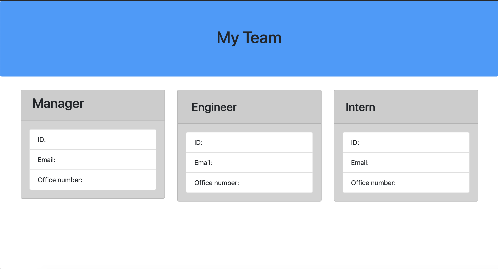

# Unit 10 OOP Homework: Template Engine - Employee Summary

One of the most important aspects of programming is writing code that is readable, reliable, and maintainable. Oftentimes, *how* we design our code is just as important as the code itself. In this homework assignment, our challenge was to build a Node CLI that takes in information about employees and generates an HTML webpage that displays summaries for each person.

[Check out the working app here!](https://drive.google.com/file/d/1nnVYZedm6SZLtg9LMz4ccM9u7xJM00Y0/view?usp=sharing)

 

